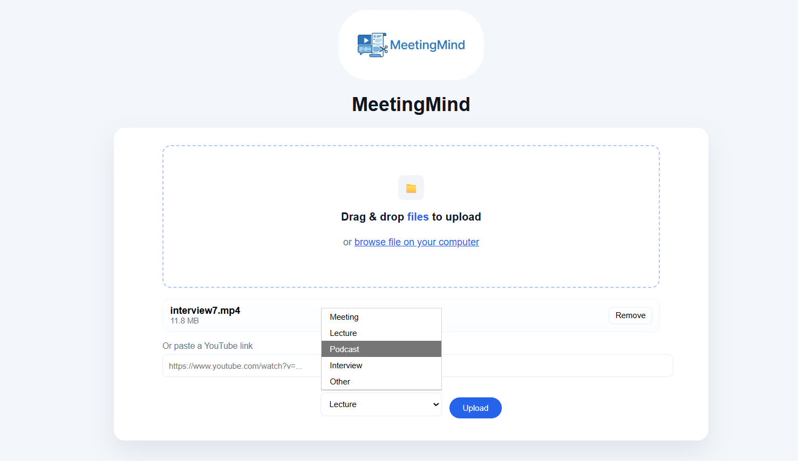
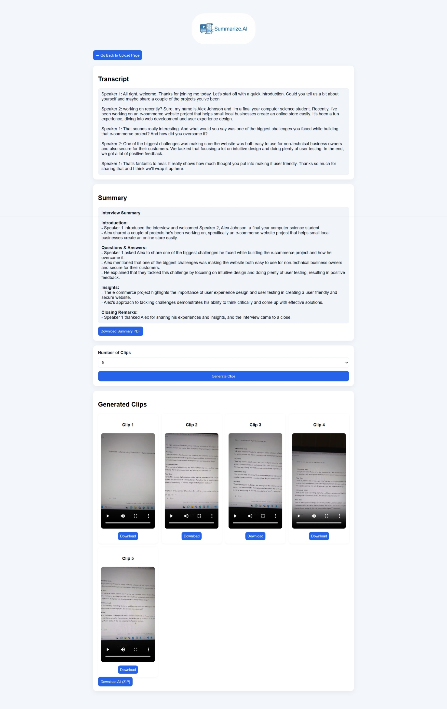

# AI Video Meeting Summarizer

An AI-powered web application that uploads meeting videos, transcribes the conversation with speaker identification, generates concise summaries, and extracts key video clips. The system helps users quickly understand long meetings without watching the entire recording.

---

## Features

- Upload meeting video or audio files
- Automatic speech-to-text transcription
- Speaker-aware transcription
- AI-generated meeting summaries
- Key moment / highlight clip generation
- Clean and responsive React-based UI
- FastAPI backend for AI processing

---

## Tech Stack

### Frontend
- React (Vite)
- JavaScript
- CSS

### Backend
- Python
- FastAPI
- OpenAI Whisper
- MoviePy

---


---

## How It Works

1. User uploads a meeting video through the frontend
2. Backend extracts audio from the video
3. Whisper transcribes speech into text
4. Speaker segments are identified
5. AI generates a structured summary
6. Key moments are extracted as short clips

---

## Getting Started (Local Setup)

### Prerequisites
- Node.js
- Python 3.9+
- pip

---

### Backend Setup

```bash
cd backend
pip install -r requirements.txt
uvicorn main:app --host 0.0.0.0 --port 8000
```

---

### Frontend Setup

```bash
cd frontend
npm install
npm run dev
```

---

### Environment Variables

Create a .env file inside the backend/ folder:
```bash
OPENAI_API_KEY=your_api_key_here
```
---

## Screenshots

### Upload Meeting Video


### Speaker-wise Transcription, Summary and Generated Highlight Clips



